# CS5610_WiSp_MERN

Photo gallery web application with location mapping capabilities.

## Project URLs
- Frontend: [https://wisp-photo-gallery-map.ue.r.appspot.com](https://wisp-photo-gallery-map.ue.r.appspot.com)
- Backend: [https://api-dot-wisp-photo-gallery-map.ue.r.appspot.com](https://api-dot-wisp-photo-gallery-map.ue.r.appspot.com)

----------------------------------------------------------------------------------------------
## Progess Summary - Iteration 3

### Completed Features
- **CSS Overhaul**: Overwrote some of the Bootstrap components with CSS for better uniformity between cards/containers like the map pin info cards and the carousel/gallery.  Added global styling for overall dark mode theme throughout the site.
- **Map Pin Links**: Added a feature for map pins to link back to the corresponding photo within the carousel so user can view photo metadata, uses index and photo ID in URL to land on the right photo.
- **Map Styling**: Used Javascript documentation from Google Maps to style the map as a night-mode type version so that it fits better with the website theme.

### Issues Resolved
- **Long/Lat - Address Conversion**: Tried a feature that allowed user to type in an address/town/zip and pull long/lat from that, but it had a vague pricing model for the Google Maps Places API so I ended up not using it to avoid any charges.
- **Client Side vs Server Side Auth**: Originally planned to replace x-user-id with actual server side authentication rather than just trusting the user id, but issues with Google Cloud led me back to just using the client side user id since it works well enough for demo purposes.

### Screenshots

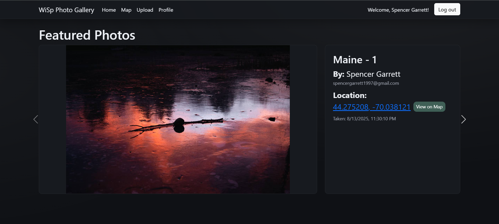
*Fixed formatting for photo cards and metadata cards so they line up better and are uniform*

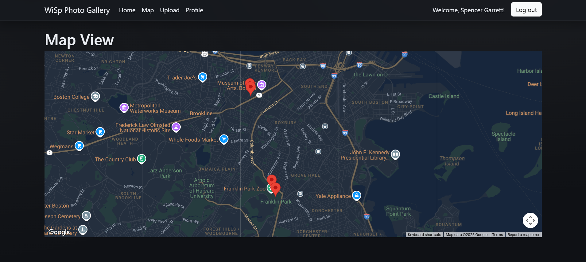
*Changed Google Maps style to fit dark mode theme for website*

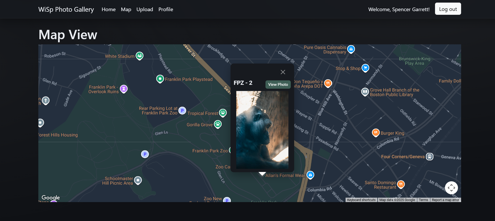
*Added 'View Photo' button to map pin cards so user can navigate to the photo in carousel*

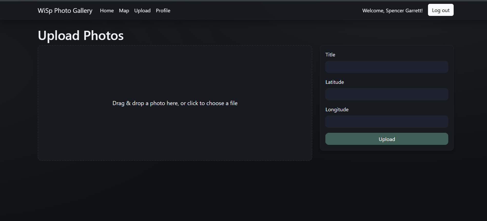
*Basic styling for upload page to match site theme and expanded DnD zone*

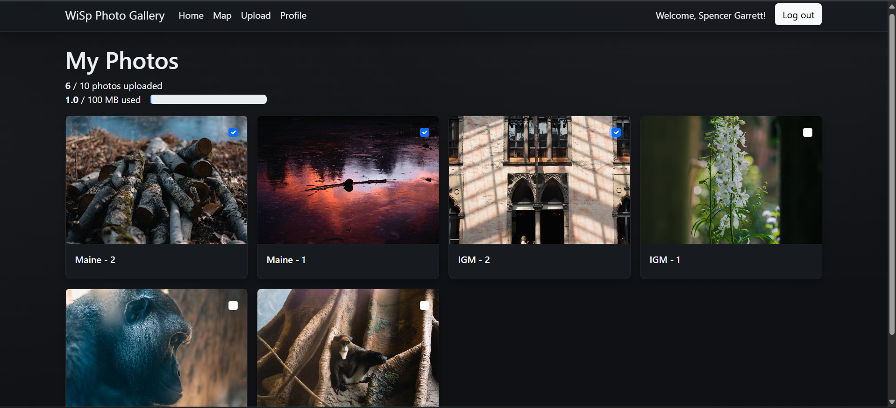
*Made profile photo cards uniform and cleaned up the checkboxes so they are more subtle*

----------------------------------------------------------------------------------------------

## Progress Summary - Iteration 2

### Completed Features
- **Photo Upload**: Drag-and-drop uploader with compression (to keep files small for free-tier).  Frontend POSTS to photos.js api/photo route.
- **Storage Limits**: Enforced per-user upload count and storage usage (again, for staying within free tier).  Storage is tracked in user db collection, updated per photo upload/delete.
- **Photo Deletion**: Multi-select with a single delete action, calls sequential DELETE requests.
- **Map Integration**: Google Map markers for photo coordinates with photo preview on click.  Still need to handle scenario of multiple photos per coordinate set.
- **UX**: Extremely basic loading, error, and empty states across pages.  Need to massively overhaul UI, no CSS implemented yet.

### Issues Resolved
- **Delete UX**: Replaced per-card delete with checkbox selection + one delete button.  Was more confusing than I expected.  Gonna swap current implementation out for batch delete function.
- **Verifying UserID in DB**: Got tripped up by which userID or ObjectID to use when referencing photos and verifying that user should be able to delete or not.
- **Build/Config**: Ensured Maps library works, had some dependecy conflicts.  Backend deployment got messed up at one point and API endpoints were all returning 404s even though they were technically live.

### Current Status
- Major CRUD aspects are implemented and functioning (Create, Read, Delete, no Update yet.)
- Front end accurately displays user photo uploads, and map renders pins properly with photo cards.
- Backend handles API requests and correctly updates DB, upload/storage limit tracking seems to be working well.

### Screenshots

### Frontend - Upload Page
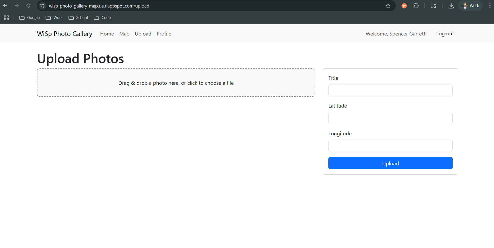
*Drag and drop + file selection working well so far*

### Frontend - Profile Page
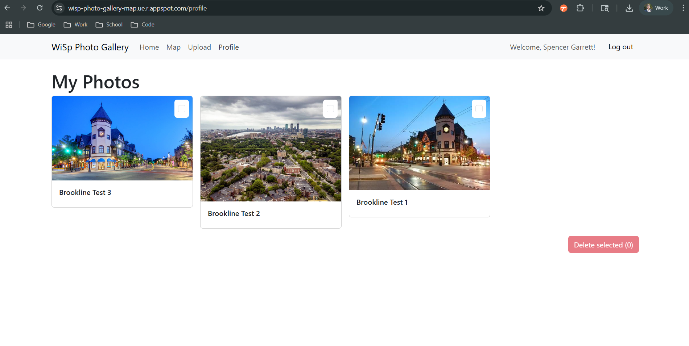
*User profile displays their uploaded photos and allows for checkbox deletion*

### Frontend - Map View  
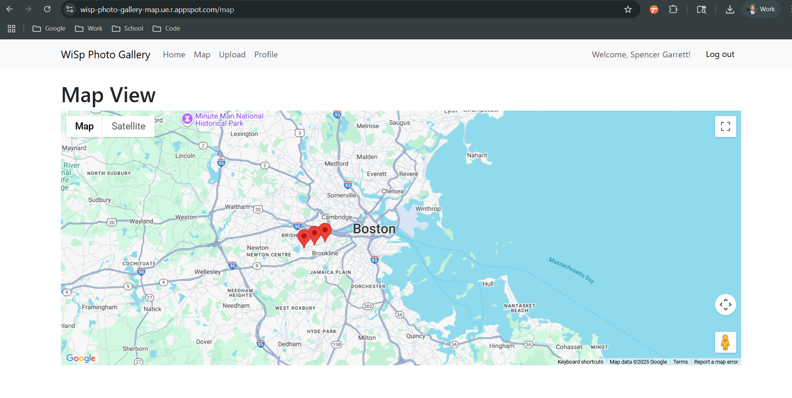
*Initial map view with pins that haven't been clicked into yet*

### Frontend - Map Expanded
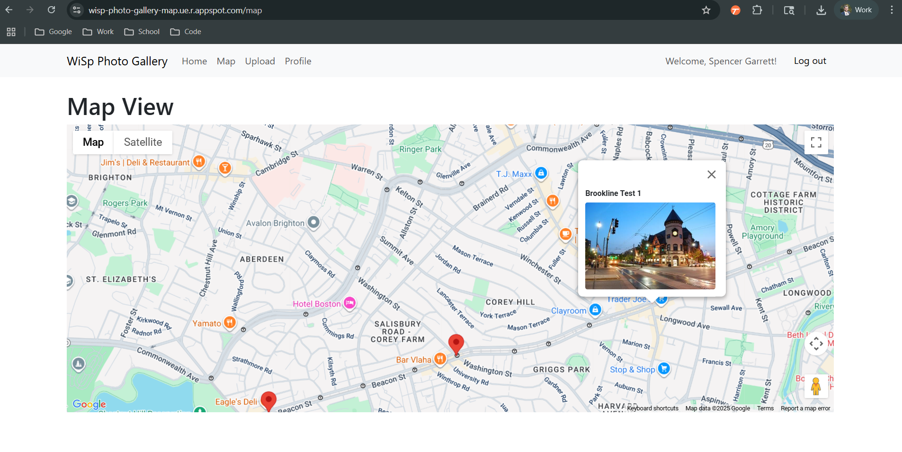
*Map view when a user clicks on one of the pins from a photo upload*

### Backend - Photo Schema
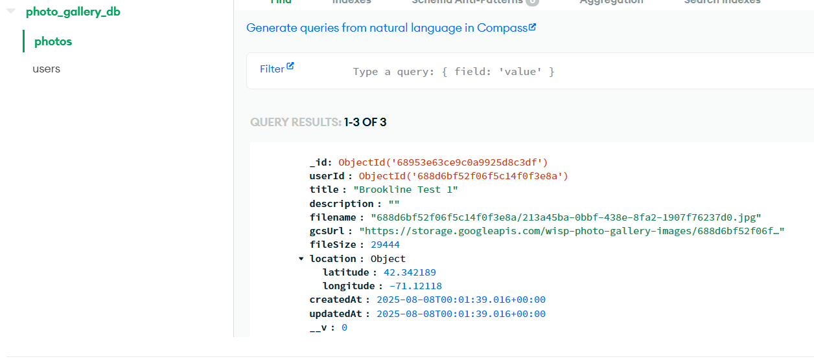
*This is the current schema for the photo collection, provides GCS link and location data*

### Next Steps - Iteration 3
- Completely overhaul visuals, full CSS needed.
- Implement home page regardless of login status.
- Replace `x-user-id` with JWT-based auth and server-side verification.
- Backend batch delete endpoint for multi-delete.
- Add address to lat/lng autocomplete from GCS API (Geocoding or Places Autocomplete).
- Paginate photo lists for main carousel/gallery page; ensure DB indexes are good at loading.
- More robust API error format and global handler.
- Add test suites and explore edge cases.

-----------------------------------------------------------------------------------------------------------------------------
## Progress Summary - Iteration 1

### Completed Features
- **Project Structure**: Monorepo setup with separate frontend and backend directories
- **Basic Routing**: Homepage, Map, Upload, and Profile pages with React Router
- **Google Authentication**: Working login/logout using Google OAuth 2.0
- **Database Setup**: MongoDB Atlas connection with User and Photo schemas
- **User Management**: Backend API to save/retrieve user data from database
- **Deployment**: Both frontend and backend deployed to Google App Engine
- **Navigation**: Navbar with conditional routing based on login status

### Issues Resolved
- **Dependency Conflicts**: Had issues on version conflicts with deprecated `react-google-login` package, transplanted login/logout code from movie website
- **Deployment Issues**: Resolved Google Cloud Build errors and environment variable configuration, staging folder got corrupted and had to nuke it.  Also tripped up on separating two directories into two services within Google Cloud.
- **Build Process**: Fixed frontend build not updating after code changes because of the staging issues
- **Package Dependecies**: Switched from npm to yarn for frontend to resolve peer dependency issues

### Current Status
- Google login working on the deployed build
- User data successfully saving to MongoDB Atlas upon first login
- Basic UI structure complete with placeholder pages, conditional upon being logged in

### Screenshots

### MongoDB Atlas - User Data Successfully Stored
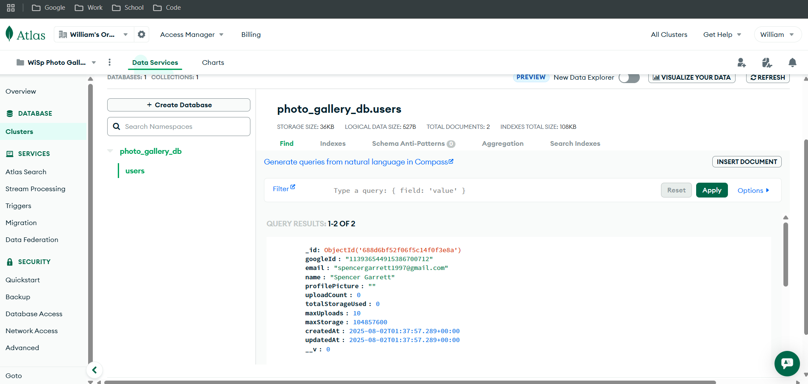
*Shows user data being successfully saved to MongoDB Atlas after Google login*

### Frontend - Login State
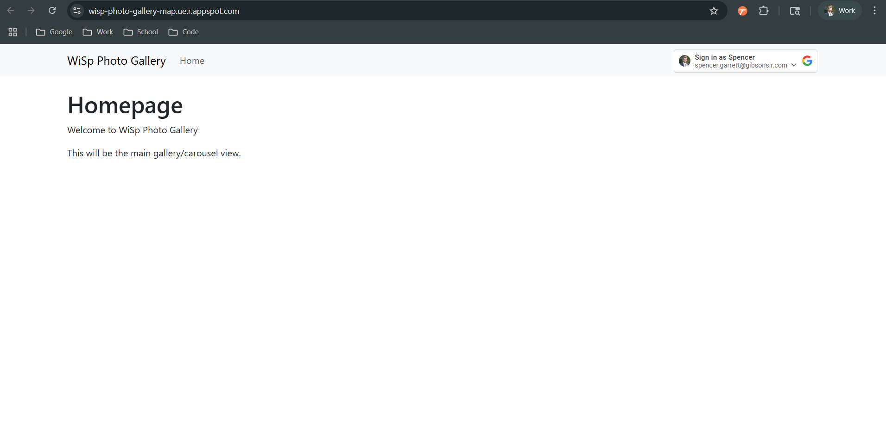
*Homepage showing Google login button for unauthenticated users*

### Frontend - Authenticated State  

*Full navigation bar visible after successful login with Map, Upload, Profile links and user welcome message*

### Next Steps - Iteration 2
- Implement photo upload and delete functionality + drag and drop
- Add photo gallery/carousel display
- Integrate map view with photo location data
- Implement user upload limitations based on DB (to ensure I stay in the free tier for storage)

---------------------------------------------------------------------------------------------------
